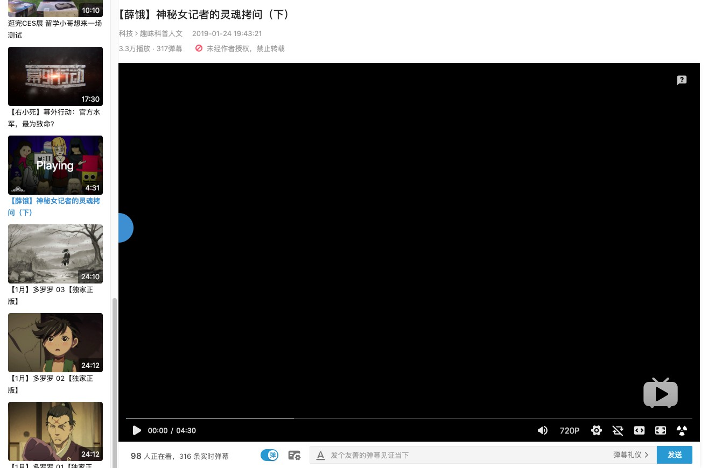

# Bilibili Watchlater Plus
Bilibili 稍后再看功能增强，使 B 站的稍后再看更加好用。

## 功能
- [首页](https://www.bilibili.com)、[右上角动态小窗](https://t.bilibili.com/pages/nav/index)、[动态页](https://t.bilibili.com/)、[空间](http://space.bilibili.com/3283205)中，已在稍后再看的视频会显示勾选

  

- [首页](https://www.bilibili.com)、[右上角动态小窗](https://t.bilibili.com/pages/nav/index)、[动态页](https://t.bilibili.com/)、[空间](http://space.bilibili.com/3283205)中，可以将动画番剧加入稍后再看

  

- 观看稍后再看视频逻辑变更：使用常规网页播放，通过新增的操作板控制

  

## 安装
首先需要安装 [Tampermonkey](https://chrome.google.com/webstore/detail/tampermonkey/dhdgffkkebhmkfjojejmpbldmpobfkfo)

## 兼容性
只测试了 最新版 Chrome 浏览器下对 Tampermonkey 的兼容性

## LICENSE
MIT
